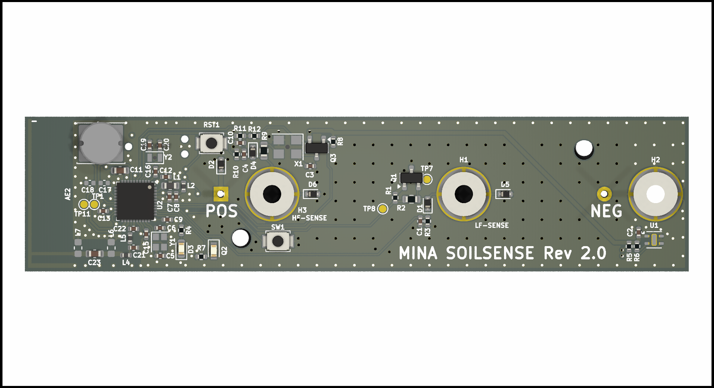
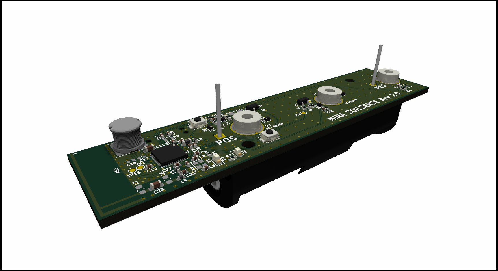
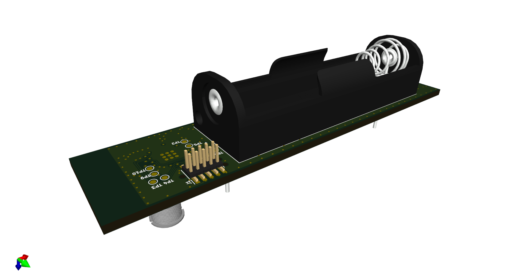

# ESP MethanSense
 

Open hardware for a nrf52833 soil moisture probe, It is designed for using M3 stainless steel rods as probes screwed into the headers H1,H2,H3

[Assembly IBOM](https://htmlpreview.github.io/?https://raw.githubusercontent.com/fredriknk/ssense/main/DOCUMENTATION/ibom.html)

[PCB layout](./DOCUMENTATION/Board.pdf)

[SCHEMATIC](./DOCUMENTATION/Schematic.pdf)

## FRONT

## BACK

