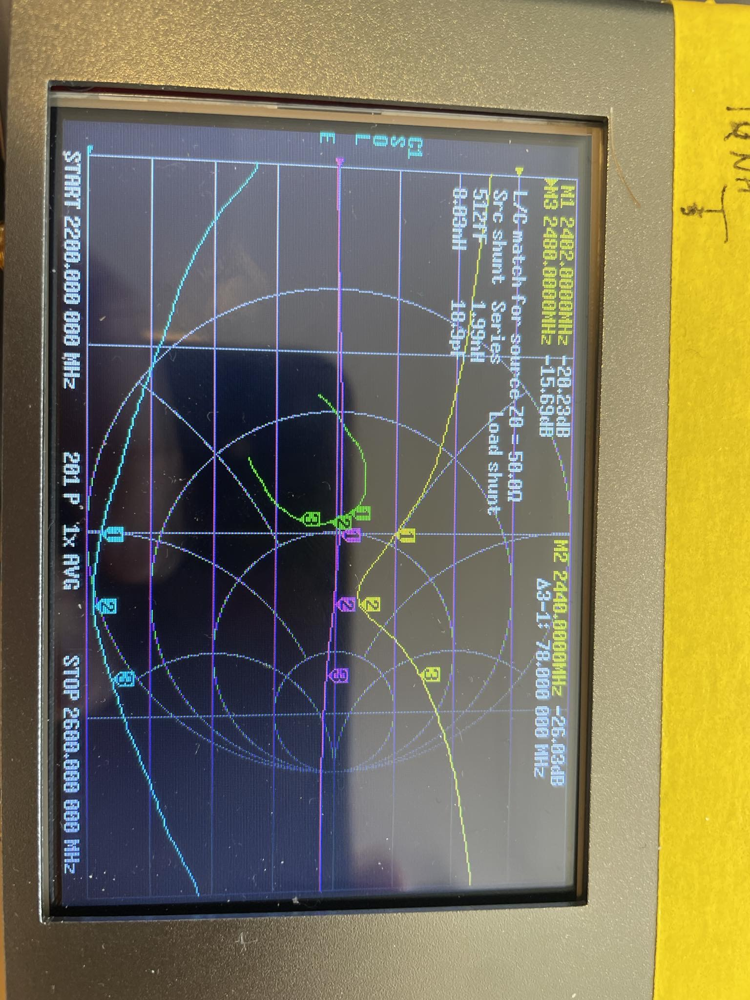
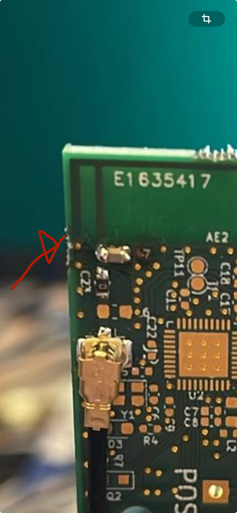
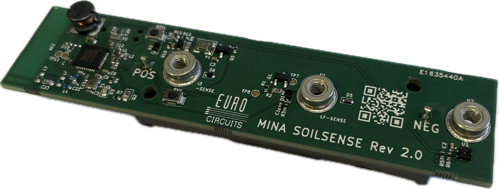

# Mina Soilsense
 

Open hardware for a Zigbee nrf52833 soil moisture probe, It is designed for using M3 stainless steel rods as probes screwed into the headers H1,H2,H3. It is designed to run on a 3.6v AA SAFT battery, average current is in the sub uA range when sampling 5 times per hour. So battery life should be in the range of 5-10 years. 

Check out the ibom tool for component placement and hand soldering
[Assembly IBOM](https://htmlpreview.github.io/?https://raw.githubusercontent.com/fredriknk/ssense/main/DOCUMENTATION/ibom.html)

[PCB layout](./DOCUMENTATION/Board.pdf)

[SCHEMATIC](./DOCUMENTATION/Schematic.pdf)

## RF Testing

The antenna is simulated and optimized in matlab with [optimization script](https://github.com/fredriknk/antennasimulation) a theoretical -44dB S11, Actual measured S11 on the RF blanks is -26dB with a 0.5pF shunt capacotor soldered to L7 and a 0R resistor at C23. I left the antenna 1mm too long for tuning, but -26db is good enough for me. 

  
   

## Production run 1

Prototype produced at Eurocircuits

## Front

## Back

